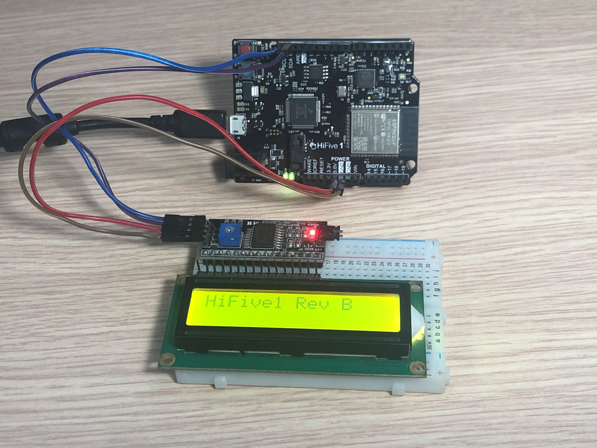

# SiFive HiFive1 Rev B with LCD I2C module
This is a library used for SiFive Hifive 1 Rev B board to communicate with Lyquid Crystal Display (LCD) with I2C module and examples of how to use this it (`LiquidCrystal_I2C.c`, `LiquidCrystal_I2C.h`). 

# Build Examples
- Use FreedomStudio IDE to create a SiFive project for HiFive 1 Rev B board.
- Then copy `LiquidCrystal_I2C.c`, `LiquidCrystal_I2C.h`, `delay.c` files and a selected example (`BlinkingCursor.c`, `CustomChars.c`, `HelloWorld.c`, `SerialDisplay.c`) in `examples` folder to your project and build.

# Hardware Requirements
- SiFive Hifive 1 Rev B board
- LCD1602 with I2C module

# Wire Connections
    HiFive1 Rev B      LCD I2C module
    IO19 (SCL)    <--> SCL
    IO18 (SDA)    <--> SDA
    5.0 V         <--> VCC
    GND           <--> GND

# Development tools
- SiFive IDE: FreedomStudio-4.7.2.2020-11-2-x86_64-w64-mingw32 (https://github.com/sifive/freedom-studio/releases/tag/v2020.11.1)

# Documents
- I2C-Master Core Specification - [i2c_specs.pdf](https://github.com/olofk/i2c/blob/master/doc/i2c_specs.pdf)
- SiFive FE310-G002 Manual v19p05 - [fe310-g002-manual-v19p05.pdf](https://sifive.cdn.prismic.io/sifive%2F59a1f74e-d918-41c5-b837-3fe01ba7eaa1_fe310-g002-manual-v19p05.pdf)
